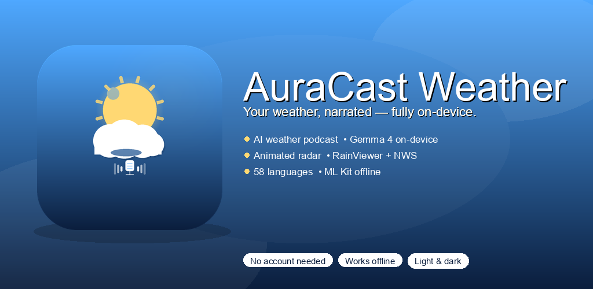
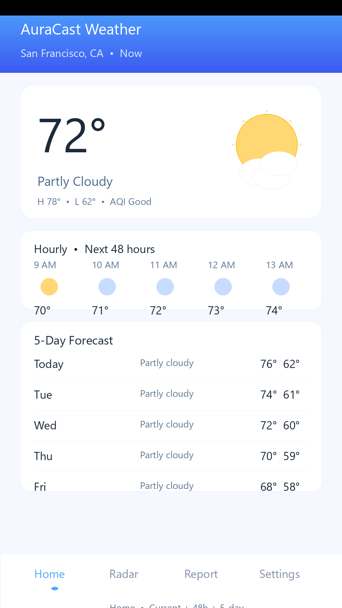
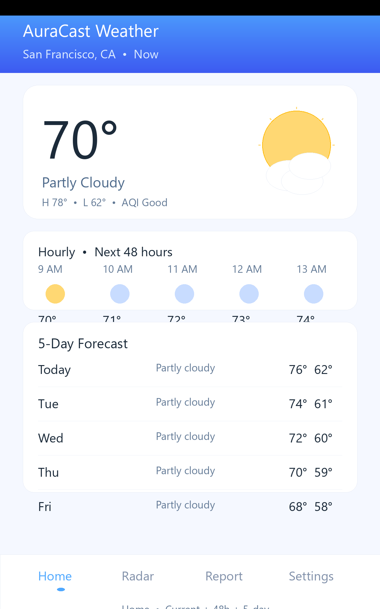
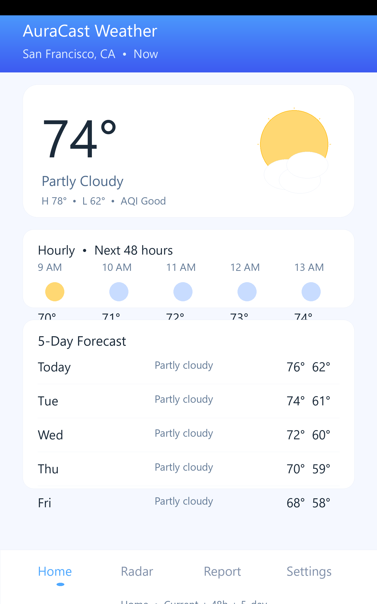

# AuraCast Weather

**Your weather, narrated — fully on-device.**

AuraCast Weather is a native Android weather app that generates a spoken weather report using an on-device AI model (Gemma 4) and real neural text-to-speech, right on your phone. No account, no cloud AI calls for the report itself, and animated precipitation radar built in.

🌐 **Website:** https://auracast-weather.web.app
🔒 **Privacy Policy:** https://auracast-weather.web.app/privacy.html
📱 **Google Play:** coming soon



## Features

- **Current, 48-hour hourly, and 5-day forecast** (Open-Meteo + NWS)
- **AI weather podcast** — a natural-sounding daily report generated on-device with Gemma 4, read aloud with a real neural voice; pick and preview your favorite voice in Settings
- **Animated precipitation radar** (RainViewer + NWS tiles) with playback controls
- **On-device translation** into 58 languages via ML Kit — no server round-trip
- **Severe weather alerts & daily briefing** notifications
- **Light/dark themes**, no account required

## Preview

Screenshots for **phone (1080×1920)**, **7″ tablet (1200×1920)** and **10″ tablet (1600×2560)** plus the **1024×500 feature graphic** and **promo video** are all live on the website and committed under `fastlane/metadata/android/en-US/images/` for Play Console.

🌐 **Live preview:** https://auracast-weather.web.app — see Screenshots & Promo sections for every form factor, or browse `website/public/screenshots/`.

| Phone | 7″ tablet | 10″ tablet |
|---|---|---|
|  |  |  |

▶ Promo: `website/public/assets/promo.mp4` (poster `promo-poster.png` 1920×1080) — also at `fastlane/metadata/android/en-US/images/promo.mp4` and embedded on the site.
- **26.8s, 1920×1080, H.264 yuv420p 30fps, AAC stereo** — 5 slides with xfade, **real human voice** (Microsoft Zira Desktop via System.Speech, loudnorm -16 LUFS, 400ms gaps, 26.8s total), icons + feature graphic + 3 screenshots, ending card shows **github.com/chartmann1590/auracast-weather** + auracast-weather.web.app. WebM VP9/Opus also provided. To publish: upload `store/promo.mp4` as **Unlisted YouTube** and paste link into `fastlane/metadata/android/en-US/video.txt` (currently placeholder) and `website/public/index.html` promo section.

Adaptive icon is in place (`mipmap-anydpi-v26/ic_launcher.xml` + PNGs for mdpi → xxxhdpi) and the launcher label is **“AuraCast Weather”** (`@string/app_name`).

## Privacy first

Your on-device AI report is generated entirely on your phone — forecast numbers are fed to a local model and the report never leaves your device. The only network calls are for fetching the weather forecast and radar imagery itself. See the full [Privacy Policy](https://auracast-weather.web.app/privacy.html) for details on what Crashlytics/Performance monitoring and ads collect.

## Tech stack

Native Android, Kotlin + Jetpack Compose, Hilt DI, Room, Coroutines/Flow. On-device inference via Google's LiteRT-LM (Gemma 4). Map rendering via osmdroid with a custom Coil-backed radar tile overlay. See `plan/` for the full build plan (16 phases).

## Building from source

```bash
./gradlew assembleDebug          # TEST ads (always, safe for any contributor)
./gradlew assembleRelease        # REAL ads when secrets are present, else test fallback
./gradlew installDebug           # with a device/emulator connected
```

Firebase (`google-services.json`) is included for Crashlytics/Performance/Messaging.

**AdMob — secure, never hardcoded:** production IDs are *never* committed. They live only in:
- `local.properties` (gitignored) for local release builds:
  ```properties
  admob.appId=ca-app-pub-XXXXXXXXXXXXXXXX~XXXXXXXXXX
  admob.bannerId=ca-app-pub-XXXXXXXXXXXXXXXX/XXXXXXXXXX
  admob.interstitialId=ca-app-pub-XXXXXXXXXXXXXXXX/XXXXXXXXXX
  ```
  A gitignored `local.properties` with the real IDs is already configured on the maintainer machine; contributors without it automatically fall back to Google's public test IDs and the app still builds.
- **GitHub Secrets** for CI (`ADMOB_APP_ID`, `ADMOB_BANNER_ID`, `ADMOB_INTERSTITIAL_ID`) — injected as env vars in `.github/workflows/build.yml`. Debug builds *always* use Google test IDs (`ca-app-pub-3940256099942544/...`) to avoid invalid-traffic strikes; release builds use the real IDs when secrets are present, otherwise test fallback so forks/PRs stay green. The workflow verifies no `ca-app-pub-` other than the test allow-list is tracked.

Play Billing uses test purchases in debug; use Play Console's licensed testers for release verification.

### Project structure

```
app/
  data/weather/     Open-Meteo + NWS
  data/radar/       RainViewer + NWS tiles
  data/location/    FusedLocationProviderClient + Open-Meteo Geocoding
  data/llm/         LiteRT-LM Gemma 4 session
  data/tts/         TextToSpeech wrapper + voice picker
  data/translate/   ML Kit Translation
  ui/home|radar|report|settings   Compose screens
  data/notifications  WorkManager + FCM
  data/monitoring     Crashlytics + Perf
  data/billing        Play Billing 9.1
website/            Landing page + privacy policy (Firebase Hosting)
```

## Support

Questions or issues? Email [support@auracast.app](mailto:support@auracast.app) or open a [GitHub issue](../../issues).

---

© 2026 AuraCast Weather · Built with Material 3, Meteocons (MIT), Material Symbols (Apache 2.0)
